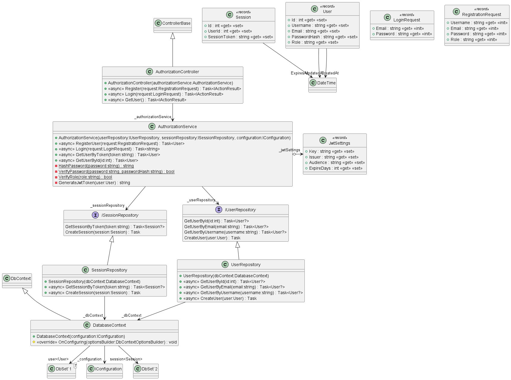
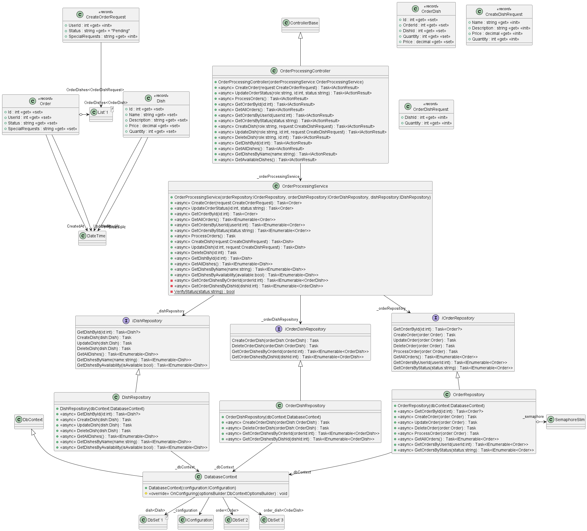

# RESTaurantAPI
##### ДЗ-4, Мыскин Николай Андреевич, БПИ212
##### C#, APS.NET, PostgreSQL

### Архитектура
Используется паттерн MVC. Сама архитектура наглядно представлена в виде классовых диаграм:

#### Микросервис авторизации пользователей


#### Микросервис обработки заказов


### База данных
В качеству базы данных использует база данных на основе PostgresSQL, подключаемая удалённо. Параметры подключения содержаться в файлах *appsettings.json* и *appsettings.Development.json*.
Создание таблиц в синтаксисе PostgreSQL:
#### auth.db
```
CREATE TABLE "user" (
    id SERIAL PRIMARY KEY,
    username VARCHAR(50) UNIQUE NOT NULL,
    email VARCHAR(100) UNIQUE NOT NULL,
    password_hash VARCHAR(512) NOT NULL,
    role VARCHAR(10) NOT NULL CHECK (role IN ('customer', 'chef', 'manager')),
    created_at TIMESTAMP DEFAULT CURRENT_TIMESTAMP,
    updated_at TIMESTAMP DEFAULT CURRENT_TIMESTAMP
);
```
```
CREATE TABLE "session" (
    id SERIAL PRIMARY KEY,
    user_id INT NOT NULL,
    session_token VARCHAR(1024) NOT NULL,
    expires_at TIMESTAMP NOT NULL,
    FOREIGN KEY (user_id) REFERENCES "user"(id)
);
```

#### orders.db
```
CREATE TABLE dish (
    id SERIAL PRIMARY KEY,
    name VARCHAR(100) NOT NULL,
    description TEXT,
    price NUMERIC(10, 2) NOT NULL,
    quantity INT NOT NULL,
    created_at TIMESTAMP DEFAULT CURRENT_TIMESTAMP,
    updated_at TIMESTAMP DEFAULT CURRENT_TIMESTAMP
);
```
```
CREATE TABLE "order" (
    id SERIAL PRIMARY KEY,
    user_id INT NOT NULL,
    status VARCHAR(50) NOT NULL,
    special_requests TEXT,
    created_at TIMESTAMP DEFAULT CURRENT_TIMESTAMP,
    updated_at TIMESTAMP DEFAULT CURRENT_TIMESTAMP
);
```
```
CREATE TABLE order_dish (
    id SERIAL PRIMARY KEY,
    order_id INT NOT NULL,
    dish_id INT NOT NULL,
    quantity INT NOT NULL,
    price NUMERIC(10, 2) NOT NULL,
    FOREIGN KEY (order_id) REFERENCES "order"(id),
    FOREIGN KEY (dish_id) REFERENCES dish(id)
);
```

### Swagger
Swagger полностью настроен для демонстрации работы обоих API. После запуска Debug-версии приложения, перейти по ссылке: `localhost:5000/swagger/index.html`.
Для простоты демонстрации в микросервисе обработки заказов упрощена "авторизация" до простого ввода роли в header'е.
